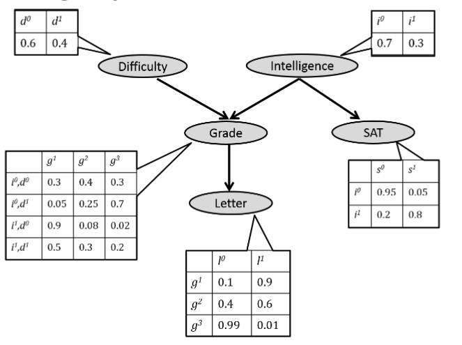

# Deep Generative Models

*These notes are based on `Stanford` `CS 236: Deep Generative Models` Course by `Stefano Ermon` and `Aditya Grover`. You can access course materials from here: <a href:"deepgenerativemodels.github.io">link</a>*

## Introduction

Challenge: Understand complex, unstructured inputs. This can be in any area:
* Computer Vision
* Natural Language Procssing
* Robotics
* Computational Speech


`Richard Feynman`: “What I cannot create, I do not understand”

## Statistical Generative Models
A statistical generative model is a probability distribution p(x)
* Data
* Prior knowledge

It is generative because sampling from p(x) generates new images.

### Disciminative vs. generative
`Discriminative`: classify bedroom vs. dining room. The input image X is always given. Goal: a good decision boundary, via conditional distribution.

`Generative`: generate X. The input X is not given. Requires a model of the joint distribution.

Joint and conditional are related via Bayes Rule.

Class conditional generative models are also possible. It’s often useful to condition on rich side information Y. A discriminative model is a very simple conditional generative model of Y.

## Learning a generative model
We are given a training set of examples, e.g., images of dogs. We want to learn a probability distribution p(x ) over images x such that:
* Generation
* Density estimation
* Unsupervised

But how should we represent p(x)?

We can use basic discrete distributions such as:
* Bernoulli
* Categorical

### Structure through independence
If X1, ..., Xn are independent, then:
```
p(x1, ..., xn) = p(x1) p(x2) p(x3) ... p(xn)
```

How many parameters to specify joint distribution? 2^(n)-1. Because p(x1) needs one parameters and we have 2^(n) states.

Using chain rule:
```
p(x1, ..., xn) = p(x1) p(x2 | x1) p(x3 | x1, x2) ... p(xn | x1, ..., xn-1)
```

So we need: 1 + 2 + ... + 2^(n-1) = 2^(n) - 1 parameters. It is still exponential.

Now suppose `Xi+1 ⊥ X1,...,Xi −1 |Xi` , then:
```
p(x1, ..., xn) = p(x1) p(x2 | x1) p(x3 | x2) ... p(xn | xn-1)
```

Now how many parameters? `2n-1`.

Bayesian Networks: assume an ordering and a set of conditional
independencies to get compact representation.

```
p(x1,...,xn ) = ∏p(xi |xAi )
```

### Beysian networks

A Bayesian network is specified by a directed acyclic graph G = (V ,E ) with:
* One node i ∈ V for each random variable Xi
* One conditional probability distribution (CPD) per node

Graph G = (V ,E ) is called the structure of the Bayesian Network
```
p(x1,...xn ) = ∏p(xi |xPa(i))
```



Bayesian network structure implies conditional independencies.

## Neural models
```
p(x1,x2,x3,x4) ≈ p(x1)p(x2|x1)pNeural(x3|x1,x2)pNeural(x4|x1,x2,x3)
```

Assumes specific functional form for the conditionals. A sufficiently deep neural net can approximate any function.

In neural models for classification we care about `p(y | x)` and assume that:
```
p(y=1 | x;α) = f(x,α)
```

In logistic regression(linear form):
```
p_logit(Y = 1 |x; α) = σ(z (α,x))

where σ(z ) = 1/(1 + e−z) and 
z(α,x) = α0 + ∑αi*xi .
```

In non-linear form:
```
p_Neural(Y = 1 |x; α,A,b) = σ(α0 + ∑αi*hi)

where h(A,b,x) = f (Ax + b) be a non-linear transformation of the inputs (features)
```


## Autoregressive Models

We can pick an ordering, i.e., order variables (pixels) from top-left (X1) to bottom-right (Xn=784). Using chain rule:
```
p(v1,··· ,v784) = p(v1)p(v2 |v1)p(v3 |v1,v2) ···p(vn |v1,··· ,vn−1)
```
Some conditionals are too complex to be stored in tabular form. So we assume:
```
p(v1,··· ,v784) = pCPT(v1; α1)plogit(v2 |v1; α2)plogit(v3 |v1,v2; α3) ··· plogit(vn |v1,··· ,vn−1; αn )

pCPT(V1 = 1; α1) = α1, p(V1 = 0) = 1 −α1

plogit(V2 = 1 |v1; α2) = σ(α20 + α21v1)

plogit(V3 = 1 |v1,v2; α3) = σ(α30 + α31v1 + α32v2)
.
.
.
```

This is a modeling assumption. We are using a logistic regression to predict next pixel based on the previous ones. Called autoregressive.

The conditional variables `Vi |V1,··· ,Vi −1` are Bernoulli with parameters
```
vi = p(Vi = 1|v1,··· ,vi −1; αi ) = p(Vi = 1|v<i ; αi ) = σ(αi0 + ∑αij*vj )
```
This is called `FVSBN`.

To improve model: use one layer neural network instead of logistic regression:
```
vi = p(vi |v1,··· ,vi −1; Ai ,ci ,αi ,bi) = σ(αi hi + bi )

hi = σ(Ai v<i + ci )
```

This is called `NADE`.

### Autoregressive vs. autoencoders
On the surface, FVSBN and NADE look similar to an autoencoder. Can we get a generative model from an autoencoder?

We need to make sure it corresponds to a valid Bayesian Network (DAG structure), i.e., we need an ordering.

we can use a single neural network (with n outputs) to produce all the parameters. In contrast, NADE requires n passes. Much more efficient on modern hardware.

### `MADE : Masked Autoregressive Density Estimator`

* Parameter sharing: use a single multi-layer neural network
* Challenge: need to make sure it’s autoregressive (DAG structure)
* Solution: use masks to disallow certain paths (Germain et al., 2015).


### RNN


Pros:
* Can be applied to sequences of arbitrary length.
* Very general: For every computable function, there exists a finite
RNN that can compute it

Cons:
* Still requires an ordering
* Sequential likelihood evaluation (very slow for training)
* Sequential generation (unavoidable in an autoregressive model)
* Can be difficult to train (vanishing/exploding gradients)

### CNN
Use convolutional architecture to predict next pixel given context (a neighborhood of pixels).

Challenge: Has to be autoregressive. Masked convolutions preserve raster scan
order. Additional masking for colors order.

## Maximum likelihood learning
Lets assume that the domain is governed by some underlying distribution Pdata. We are given a dataset D of m samples from Pdata. The standard assumption is that the data instances are independent and
identically distributed (IID). We are also given a family of models M, and our task is to learn some
“good” model ˆM∈M (i.e., in this family) that defines a distribution p ˆM. The goal of learning is to return a model ˆM that precisely captures the distribution Pdata from which our data was sampled. This is in general not achievable because of:
* Limited data
* Computational reasons

What is "best"? This depends on what we want to do:
* Density Estimation
* Specific prediction tasks
* Structure or knowledge discovery

We want to learn the full distribution so that later we can answer any probabilistic inference query. In this setting we can view the learning problem as density estimation. We want to construct Pθ as ”close” as possible to Pdata.
 
 
 How should we measure distance between distributions? Kullback-Leibler divergence (KL-divergence)
 ```
D (p‖q) = ∑p(x)*(log (p(x)/q(x)))
 ```
 *Note that KL-duvergence is asymmetric
 
 Now we have:
 ```
D(Pdata||Pθ) = Ex∼Pdata[log(Pdata(x)/Pθ(x))]
              = Ex∼Pdata [log Pdata(x)] −Ex∼Pdata [log Pθ(x)]
 ```
 
 So minimizing KL divergence is equivalent to maximizing the expected log-likelihood.
 ```
 maxPθ [(1/|D|) * ∑log Pθ(x)]
 Pθ(x(1),··· ,x(m)) = ∏Pθ(x)
 ```
 
 ## Latent variable models
 
